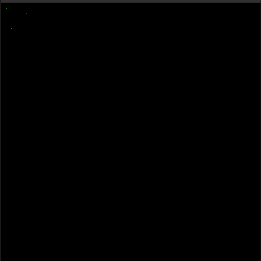
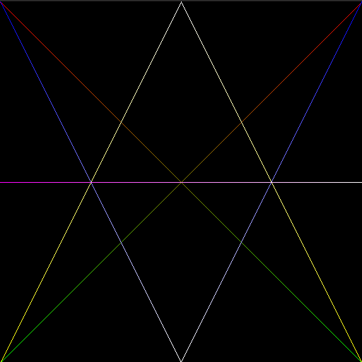
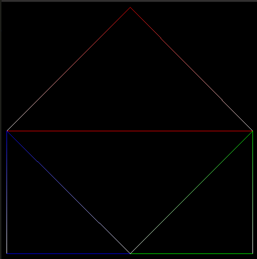

# Introdução à Computação Gráfica

## Antonio Jonas G. de Oliveira 2016021023
## Thiago Alves de Araujo	2016019787

# Sumário
* [Introdução](#introdução)
* [Framework](#framework)
* [Funções Propostas](#funções-propostas)
	* [PutPixel](#PutPixel)
	* [DrawLine](#DrawLine)
	* [DrawTriangle](#DrawTriangle)
* [Conclusão](#conclusão)
* [Código Fonte](https://github.com/JonasGoncalves/CG/tree/master/Trabalho%201%20-%20Rasteriza%C3%A7%C3%A3o)
* [Referências](#referencias)
---

## Introdução

Esse relatório busca mostrar como foi desenvolvido o primeiro trabalho da dicisplina de Introdução a Computação Gráfica, utilizando de um framework fornecido pelo professor e propor o desenvolvimento de três funções referentes ao tema de rasterização e também o primeiro contato com a ferramenta OpenGL.

---

## Framework

O framework usado, foi disponibilizado pelo professor, e permite que o aluno consiga, através de uma simulação, acessar a memória para efetuar as operações necessárias, como a rasterização por pontos, linhas e triângulos, visto que os Sistemas Operacionais não permitem que o usuário tenha esse acesso.

---

## Funções Propostas

Era necessário a implementação de três funções usando o algoritmo de rasterização de Bresenham, que cria linhas em dispositivos matriciais, permitindo a determinação de quais são os pontos numa matriz de base quadrada que devemm ser destacados com o intuito de atender o grau de inclinação de ângulo.
Inicialmente será feito a implementação da função PutPixel, que criará um ponto na memória, depois usar dois pontos para criação de uma linha, e por fim usar as linhas para a criação de um triângulo.

## PutPixel
Sabemos que o Pixel é o menor elemento em um dispositivo de exibição (como por exemplo o monitor), em que podemos designar uma cor (RGB), e um grau de transparência (Alpha). Ele é o menor ponto que forma uma imagem.

A seguir veremos como foi implementado a função PutPixel na linguagem C.

A função a cima possui:

>1. (X,Y) é a coordenada das posições que deve ser desenhada na tela.
>2. RGBA diz respeito as cores.

	 
	
	<h5 align="center">Figure 2 - Pixel vermelho desenhado na tela</h5>
	 

---

## DrawLine

O drawnline irá utilizar uma variação do algoritmo de Bresenham, que pegará dois pontos e criará uma linha, em angulações diversas, e as linhas possuem cores variadas, através da interpolação linear. Iniciantemente algoritmo de bresenham funciona para retas com inclinação positiva tanto no eixo X (com dx > 0) como no eixo Y (com dy > 0). Assim, foi necessário acrescentarmos condições (baseadas em técnicas de simetria) para adequarmos as demais retas que não se encaixavam nestas condições iniciais.

> - Primeira Restrição: Verificamos se a variação em dx é maior que dy. Isso é necessário para definirmos qual eixo possui uma maior taxa de variação. 

> - Segunda Restrição: Verificamos o sinal de dy. Caso ele seja negativo, o valor de y deve decrescer conforme a reta é gerada. Caso contrario, o valor de y cresce normalmente, e em ambos os casos o x cresce normalmente.

> - Terceira Restrição: Caso a variação em dy seja maior que a variação em dx, devemos iniciar verificando o sinal se dy. Caso dy seja negativo, o valor y deve decrescer conforme a reta é gerada. Além disso, a variação em y deve ser maior que em x.

	 
	
	<h5 align="center">Figure 3 - Linhas desenhadas com DrawLine</h5>
	 

---

## DrawTriangle

Com a criação do DrawLine, para criar o triângulo precisa somente definir três retas. A seguir podemos ver como ficou a função na linguagem C.

	 
	
	<h5 align="center">Figure 4 - Triângulos desenhados pelo DrawTriangle</h5>
	 

---
## Conclusão

Como podemos observar, o trabalho conseguiu cumprir seus objetivos, conseguindo desenhar pontos, retas e triângulos, com as cores variando, através da interpolação linear.

## Desafios

O maior desafio foi adaptar o algoritmo de Bresenham, que funciona apenas para um octante, e conseguir generalizar o algoritmo para que se consiga resolver todas as situações dos oito octantes, dessa forma desenvolver a lógica das restrições foi a parte mais que trouxe a maior dificuldade para a realização do trabalho.

---

## Referências