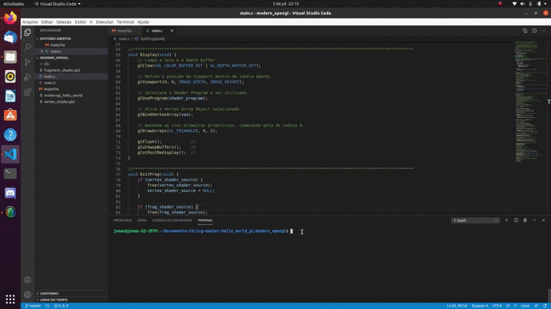

# Introdução à Computação Gráfica

## Antonio Jonas G. de Oliveira 2016021023
## Thiago Alves de Araujo	2016019787

---

# Trabalho 2 - OpenGL Moderno

# Sumário
* [Introdução](#introdução)
* [Resultados](#resultados)

---

## Introdução

Este trabalho busca assegurar se o ambiente de desenvolvimento com o OpenGL 3.3 está configurado de forma certa na máquina, e familiarizar os estudantes com a estruturação do Modern OpenGL.

---

## Resultados

Podemos visualizar pelo vídeo que o programa foi compilado e está funcionando de forma correta.

	 
	
	<h5 align="center">Triangulo - Modern OpenGL</h5>
	 

---

Link do Video no momento da compilação no Youtube: 

