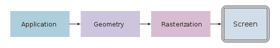

# Introdução à Computação Gráfica

## Antonio Jonas G. de Oliveira 2016021023
## Thiago Alves de Araujo	2016019787

---

# Trabalho 3 - Pipeline Gráfico

# Sumário
* [Introdução](#introdução)
* [Exercício 1](#exercício-1)
* [Exercício 2](#exercício-2)
* [Exercício 3](#exercício-3)
* [Exercício 4](#exercício-4)
* [Exercício 5](#exercício-5)
* [Referências](#referências)


## Introdução

Esse trabalho busca apresentar o conceito de Pipeline Gráfico usando as transformações geométricas. Foi usado a GLM como biblioteca junto ao OpenGL. Vale salientar que o glm usa um padrão onde as linhas e colunas tem a posição trocada na representação da matriz.

O pipeline gráfico é um modelo conceitual que descreve quais passos um sistema gráfico precisa realizar a renderização de uma cena 3D para uma cena 2D. 

<p align="center">
	<br>
	
	<h5 align="center">Figure 1 - Estrutura Pipeline Gráfico</h5>
	<br>
</p>

Os objetos no espaço do universo podem passar por transformações, sendo elas escalares, de translação ou rotação, representado por matrizes.

<p align="center">
	<br>
	
	<h5 align="center">Figure 2 - Projeção da Transformação</h5>
	<br>
</p>

## Exercício 1

Utilizando o template para atividade, temos a seguinte imagem gerada.

<p align="center">
	<br>
	
	<h5 align="center">Figure 3 - Execução Template</h5>
	<br>
</p>

A primeira atividade consiste na mudança da **Escala** dos triângulos, utilizando os fatores fornecidos, sendo eles (x,y,z) = (1/3, 3/2, 1), assim a matriz Model Array que foi utilizada é vista a seguir.

```C++

float model_array[16] =     {0.3f, 0.0f, 0.0f, 0.0f, 
                             0.0f, 1.5f, 0.0f, 0.0f, 
                             0.0f, 0.0f, 1.0f, 0.0f, 
                             0.0f, 0.0f, 0.0f, 1.0f};
    glm::mat4 model_mat = glm::make_mat4(model_array);

```
O resultado do exercício é exibido a seguir.

<p align="center">
	<br>
	
	<h5 align="center">Figure 4 - Exercicio Escala</h5>
	<br>
</p>

## Exercício 2

Em seguida foi feito a **Translação** com fatores (x,y,z) = (1,0,0), usando a matriz fornecida nas notas de aula, como vemos a seguir.

```C++
float model_array[16] =     {1.0f, 0.0f, 0.0f, 0.0f, 
                             0.0f, 1.0f, 0.0f, 0.0f, 
                             0.0f, 0.0f, 1.0f, 0.0f, 
                             1.0f, 0.0f, 0.0f, 1.0f};
    glm::mat4 model_mat = glm::make_mat4(model_array);
```

O resultado da translação é visto em seguida.

<p align="center">
	<br>
	
	<h5 align="center">Figure 5 -Exercicio Translação</h5>
	<br>
</p>

## Exercício 3

Nesse exercício foi feito a **Projeção**, utilizando o parâmetro d = 1/2 na matriz Proj_array, ficamos com a seguinte matriz.

```C++
float proj_array[16] =     {1.0f, 0.0f, 0.0f, 0.0f, 
                            0.0f, 1.0f, 0.0f, 0.0f, 
                            0.0f, 0.0f, 1.0f, -2.0f, 
                            0.0f, 0.0f, 0.5f, 1.0f};
```
O resultado do exercício é visto abaixo.

<p align="center">
	<br>
	
	<h5 align="center">Figure 6 -Exercicio Projeção</h5>
	<br>
</p>

## Exercício 4

O próximo exercício será o **Posicão de Câmera**, onde primeiro será feito a criação das coordenadas (x,y,z) da câmera, e o vetores (u, c, p), que representam o Up da câmera, ponto e posição, respectivamente. Depois, o Xc,Yc,Zc são definidos, sendo esses de fato os vetores que representam as coordenadas da câmera. 

Em seguida, define-se as matrizes B, T e BT e será feito a multiplicação da BT pela T e será definido a matriz View, como vemos na imagem abaixo.

<p align="center">
	<br>
	
	<h5 align="center">Figure 7 -Matrizes BT , T</h5>
	<br>
</p>

Usando a posição da câmera (-0.1, 0.1, 0.25), podemos observar o código em Linguagem C++ que representa a solução para o exercício 4.

```C++

    float p[3] = {-0.1f, 0.1f, 0.25f};	//Posição da camera
    float c[3] = {0.0f, 0.0f, 0.0f};	//Ponto
    float u[3] = {0.0f, 1.0f, 0.0f};	//Up da camera

    float d[3] = {0.1f, -0.1f, -0.25f};	//Direção = Ponto - Posição da camera

    float Zc[3] = {-0.4f, 0.4f, 1.0f};	//-d/|d|
    float Xc[3] = {0.93f, 0.0f, 0.37f};	//(uxz)/|uxz|
    float Yc[3] = {0.13f, 0.94f, -0.32f};	//(ZcxXc)/|ZcxXc|

    float Bt[16] = {0.93f,  0.13f, -0.4f, 0.0f, 
                     0.0f,  0.94f,  0.4f, 0.0f, 
                    0.37f, -0.32f,  1.0f, 0.0f, 
                     0.0f,   0.0f,  0.0f, 1.0f};

    float T[16] = {1.0f, 0.0f, 0.0f, 0.0f, 
                   0.0f, 1.0f, 0.0f, 0.0f, 
                   0.0f, 0.0f, 1.0f, 0.0f, 
                   0.1f, -0.1f, -0.25f, 1.0f};

    float BtT[16] = {0.93f, 0.13f, -0.4f, 0.0f, 
                     0.0f, 0.94f, 0.4f, 0.0f, 
                     0.37f, -0.32f, 1.0f, 0.0f, 
                     0.0005f, -0.001f, -0.33f, 1.0f};

```

Após a execução, temos:

<p align="center">
	<br>
	
	<h5 align="center">Figure 8 -Exercicio Posição Câmera</h5>
	<br>
</p>

## Exercício 5

No ultimo exercício foi feito **Transformações Livres** na cena feita anteriormente.

As Transformações foram:

* Model: 

```C++
    float model_array[16] = {1.0f, 0.0f, 0.0f, 0.0f, 
                             0.0f, 1.0f, 0.0f, 0.0f, 
                             0.0f, 0.0f, 1.0f, 0.0f, 
                             0.2f, 0.0f, 0.0f, 1.0f};
    glm::mat4 model_mat = glm::make_mat4(model_array);
```

* Projection:

```C++
    float proj_array[16] = {1.0f, 0.0f, 0.0f, 0.0f, 
                            0.0f, 1.0f, 0.0f, 0.0f, 
                            0.0f, 0.0f, 1.0f, -2.0f, 
                            0.0f, 0.0f, 0.5f, 1.0f};

    glm::mat4 proj_mat = glm::make_mat4(proj_array);
```

* View:

```C++

    float l[3]	= {0.0f, 0.0f, 0.0f};
    float p[3]	= {0.05f, 0.05f, 0.2f};
    float u[3]	= {0.0f, 1.0f, 0.0f};

    glm::vec3 Look_At = glm::make_vec3(l);
    glm::vec3 camPos  = glm::make_vec3(p);
    glm::vec3 camUp   = glm::make_vec3(u);
    
    glm::vec3 camZ = glm::make_vec3(glm::normalize(camPos - Look_At));
    glm::vec3 camX = glm::make_vec3(glm::normalize(glm::cross(camUp, camZ)));
    glm::vec3 camY = glm::make_vec3(glm::cross(camZ, camX));

    float Bt_array[16] = {camX.x, camY.x, camZ.x, 0.0f,
                     	  camX.y, camY.y, camZ.y, 0.0f,
                      	  camX.z, camY.z, camZ.z, 0.0f,
                    	    0.0f,   0.0f,   0.0f, 1.0f};

    float T_array[16] = {	1.0f,	0.0f,	0.0f,	0.0f,
		       				0.0f,	1.0f,	0.0f,	0.0f,
		         			0.0f,	0.0f,	1.0f,	0.0f,
		    				-camPos.x,	-camPos.y,	-camPos.z,	1.0f};

```

O resultado é visto a seguir.

<p align="center">
	<br>
	
	<h5 align="center">Figure 9 -Exercicio Transformações Livre</h5>
	<br>
</p>

## Referências

* Notas de Aula do Professor Christian