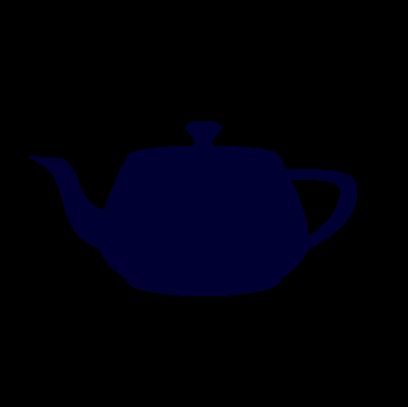
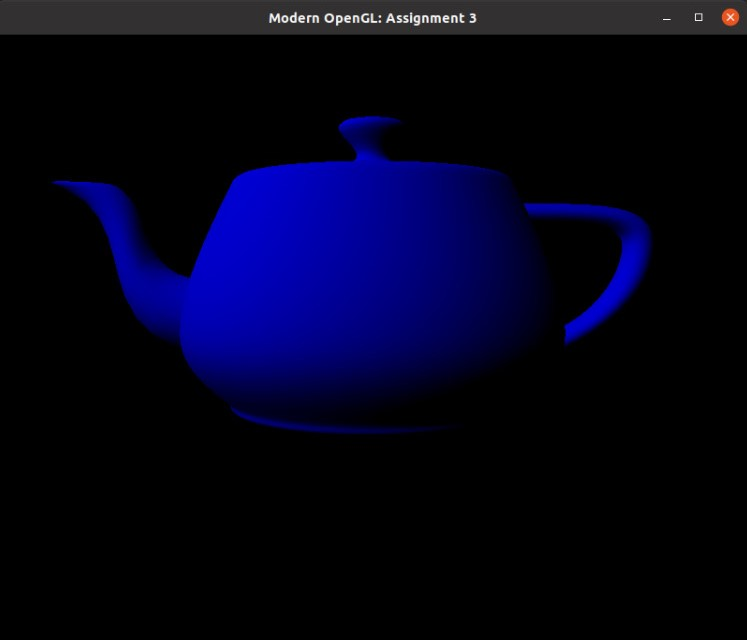
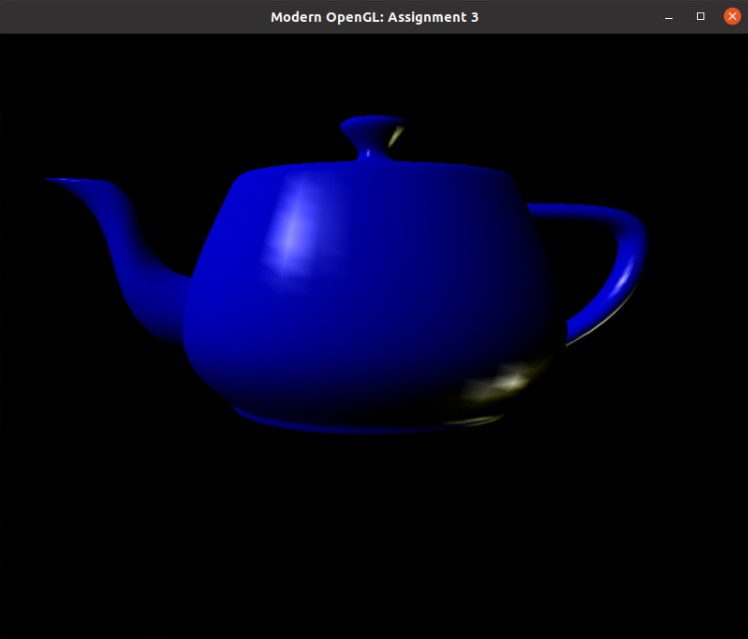

# Introdução à Computação Gráfica

## Antonio Jonas G. de Oliveira 2016021023
## Thiago Alves de Araujo	2016019787

---

# Trabalho 4 - Modelos de Iluminação

# Sumário
* [Introdução](#introdução)
* [Exercício 1](#exercício-1)
* [Exercício 2](#exercício-2)
* [Referências](#referências)

## Introdução

Esse trabalho busca apresentar alguns conceitos de Iluminação, apresentando modelos como: Ambiente, Difuso e Especular. O **modelo de luz ambiente** representa a **reflexão** da luz incidente, e é representada pela fórmula matemática:

## I = Ia * Ka

Onde Ia é a intensidade da luz no ambiente e o Ka é o coeficiente de reflexão no ambiente. Foi utilizado o template disponibilizado pelo professor, e o arquivo que deve ser manipulado para realizar o trabalho é o **Vertex Shader**, e quando o executamos o template observamos a seguinte imagem:

<p align="center">
	<br>
	
	<h5 align="center">Figure 1- Template</h5>
	<br>
</p>


## Exercício 1

O primeiro exercício será feito com o **modelo de luz difusa**, na qual a luz é refletida em todas as direções, ela também depende da cor do objeto, da posição da luz e da orientação(Vetor Normal) da face onde está o ponto, e dá origem ao efeito Degradé nos objetos. A equação que expressa esse modelo é vista a seguir:

## I= Ip * Kd * cos(θ)
## cos(θ) = N ⋅ L

A variável Ip significa Intensidade do Ponto, Kd o coeficiente de reflexão difusa, e o tetha é o ângulo entre o vetor normal e a fonte de direção da luz. A formula geralmente é combinada com a do ambiente, tendo:

## I= Ia * Ka + Ip * Kd * cos(θ)

Podemos ver a implementação no código a seguir:

```C++
    vec3 N = normalize (mat3 (transpose (inverse (model_mat))) * obj_spc_N);
    vec3 L = normalize (I_p_pos - (model_mat * vec4 (obj_spc_vertex_pos , 1.0)).xyz);

    float cos0 = dot(N,L);

    I = (I_a * k_a) + (I_p * k_d * cos0);
```
O resultado do exercício 1 é exibido a seguir.

<p align="center">
	<br>
	
	<h5 align="center">Figure 2 - Resultado Exercicio 1</h5>
	<br>
</p>

## Exercício 2

O segundo exercício será feito com o **modelo de luz especular**, se entende como a componente da luz que produz o brilho mais acentuado, e depende da cor e posição da luz, do observador e da orientação, e gera um brilho com a cor da luz, e não com a cor do objeto. A seguir vemos a equação matemática do modelo:

## I = Ip * Ks * Cos(α)^n

## I = (Ia * Ka) + (Ip * Kd * cos(θ)) + (Ip * Ks * Cos(α)^n)

```C++
    vec3 N = normalize (mat3 (transpose (inverse (model_mat))) * obj_spc_N);
    vec3 L = normalize (I_p_pos - (model_mat * vec4 (obj_spc_vertex_pos , 1.0)).xyz);

    vec3 R = -reflect  (L, N);
    vec3 V = normalize (cam_pos - (model_mat * vec4 (obj_spc_vertex_pos , 1.0)).xyz);

    float cos0 = dot(N,L);
    float cosA = dot(R,V);
    
    I = (I_a * k_a) + (I_p * ((k_d * cos0) + (k_s * (pow(cosA, n)))));
```

O resultado do exercício 2 é visto em seguida.

<p align="center">
	<br>
	
	<h5 align="center">Figure 3 -Exercicio 2</h5>
	<br>
</p>

## Referências

* Notas de Aula do Professor